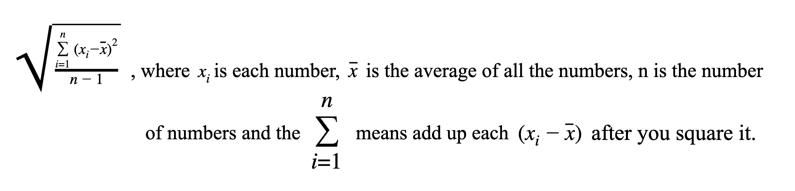
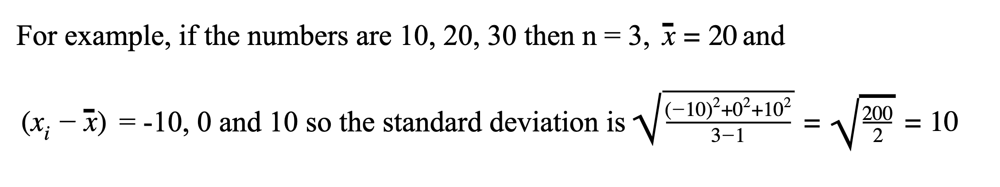

# Lab 3
### Statistics Package

#### Objective: To continue to learn about the *built-in array*, *sort data* in ascending order and calculate statistical features in a menu-driven program.

#### Part I
Generate a random number between 30 to 50 inclusive.  Declare an array in the *main method Lab_3( )* of that size and then fill the array with random integers between -100 to 100 inclusive.  Using a separate method, display the list to the screen in a presentable fashion (e.g. 10 integers per line), then by writing your own sort method, order the list from smallest to largest, and then re-call the display method on the sorted list.  When writing your sort method efficiency is NOT important, using a second array is a GOOD idea. 

#### Part II
Write the follwong five methods where they perform the described task and return the appropriate result. (The name of the method is in italics).  

 
1. *mean* returns the arrays arithmetic average .       	
 
2. *median* returns the middle value if the length of the list is odd; or the average of the two middle values if the length is even.
 
3. *mode* returns a String stating the most frequently occurring value ( tricky since 	there can be one mode, two or bi-modal, or larger than two is called No Mode )  Yours needs to solve up to bi-modal, beyond is the challenge.
 
4. *range* returns the difference between the highest and lowest values.

5. *standardDeviation* returns 
 


#### Notes
* No class arrays should be used.
* You may use Math.sqrt( ) for Standard deviation, and Math.random() for random numbers if you like,but that is the only Math method allowed.
* No other classes or libraries are allowed.
* You wrote a power method if you want to use it.  
* All methods should accept the array as a parameter, and that is the only parameter.
* Reminder you may only use the knowledge of things we have discussed in class.

### Scoring Guide

| Requirement | Possible Points |
| :---        |    :----:   | 
| On time submission | 4 | 
| Header filled in with name, block, etc. | 2 |
| Correctly uploaded zipped replit project to Google Classroom | 2 |
| Create 1 built-in array of appropriate size | 1 |
| Properly loaded 30 - 50 random integers | 2 |
| Properly sort the array with your own sort method | 2 |
| Displays the data as requested | 2 |
| Correct *mean* method value returned | 3 |
| Correct *median* method value returned | 3 |
| Correct *mode* method value returned | 3 |
| Correct *range* method value returned | 3 |
| Correct *standardDeviation* method value returned | 3 |
| **Total:** | **30** |

### Here is what a couple sample runs of this program should look like: 

```
Welcome to The Statistics Package!

  -4  13 -32 -28 -48  93  -5  44  23 -65
  64  67 -15 -58  45  18  48 -30  67  98
 -36 -79  57  92  42 -65  74 -91  -7 -78
 -83  84 -60  75 -89  -3 -37 -25 -78  -3
  97  38 -34  -5  -3 -31  85  10 -91

 -91 -91 -89 -83 -79 -78 -78 -65 -65 -60
 -58 -48 -37 -36 -34 -32 -31 -30 -28 -25
 -15  -7  -5  -5  -4  -3  -3  -3  10  13
  18  23  38  42  44  45  48  57  64  67
  67  74  75  84  85  92  93  97  98

The mean is: 1.0408163265306123
The median is: -4.0
The Mode is: -3
The range is: 189.0
The Standard Deviation is: 58.51529685463788

Thank you for using my program.
```

```
Welcome to The Statistics Package!

  89 -56 -14 -89 -33  98 -21  96  58  93
  24  29 -51  48  93 -30 -39 -41  40 -90
  11 -79  73  -6  47  43 -17 -94 -35  76
  98  69

 -94 -90 -89 -79 -56 -51 -41 -39 -35 -33
 -30 -21 -17 -14  -6  11  24  29  40  43
  47  48  58  69  73  76  89  93  93  96
  98  98

The mean is: 12.1875
The median is: 17.5
The Mode is: 93, 98
The range is: 192.0
The Standard Deviation is: 62.69045176049925

Thank you for using my program.
```

```
Welcome to The Statistics Package!

  71 -69  68 -79  82   1  -8  -1  18 -34
  85  37  47 -15 -17   4  48  85  97 -32
 -43 -55  84  87  90 -93 -60 -22 -22  41
 -62  -3 -93 -74 -36  45 -30  85 -12  55
 -22 -74  26  56 -80  22 -57 -98

 -98 -93 -93 -80 -79 -74 -74 -69 -62 -60
 -57 -55 -43 -36 -34 -32 -30 -22 -22 -22
 -17 -15 -12  -8  -3  -1   1   4  18  22
  26  37  41  45  47  48  55  56  68  71
  82  84  85  85  85  87  90  97

The mean is: 0.8958333333333334
The median is: -5.5
The Mode is: No Mode
The range is: 195.0
The Standard Deviation is: 59.213368093640035

Thank you for using my program.
```