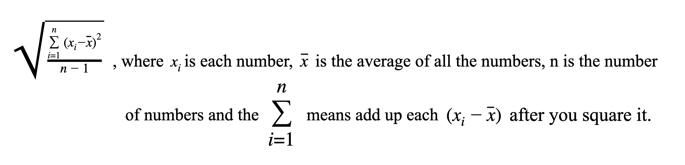
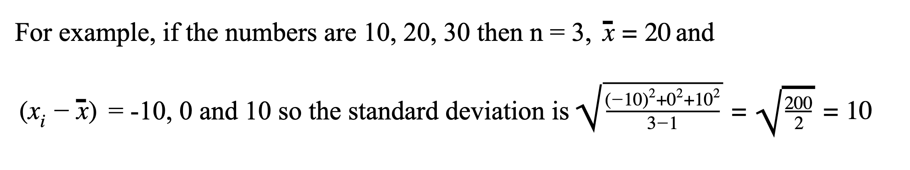

# Lab 3
### Statistics Package

#### Objective: To continue to learn about the *built-in array*, *sort data* in ascending order and calculate statistical features in a menu-driven program.

#### Part I
Generate a random number between 30 to 50 inclusive.  Declare an array in the *main method Lab_3( )* of that size and then fill the array with random integers between -100 to 100 inclusive.  Using a separate method, display the list to the screen in a presentable fashion (e.g. 10 integers per line), then by writing your own sort method, order the list from smallest to largest, and then re-call the display method on the sorted list.  When writing your sort method efficiency is NOT important, using a second array is a GOOD idea. 

#### Part II
Write the follwong five methods where they perform the described task and return the appropriate result. (The name of the method is in italics).  

 
1. *mean* returns the arrays arithmetic average .       	
 
2. *median* returns the middle value if the length of the list is odd; or the average of the two middle values if the length is even.
 
3. *mode* returns a String stating the most frequently occurring value ( tricky since 	there can be one mode, two or bi-modal, or larger than two is called No Mode )  Yours needs to solve up to bi-modal, beyond is the challenge.
 
4. *range* returns the difference between the highest and lowest values.

5. *standardDeviation* returns 
 

#### Notes
* No class arrays should be used.
* You may use Math.sqrt( ) for Standard deviation, and Math.random() for random numbers if you like,but that is the only Math method allowed.
* No other classes or libraries are allowed.
* You wrote a power method if you want to use it.  
* All methods should accept the array as a parameter, and that is the only parameter.
* Reminder you may only use the knowledge of things we have discussed in class.
